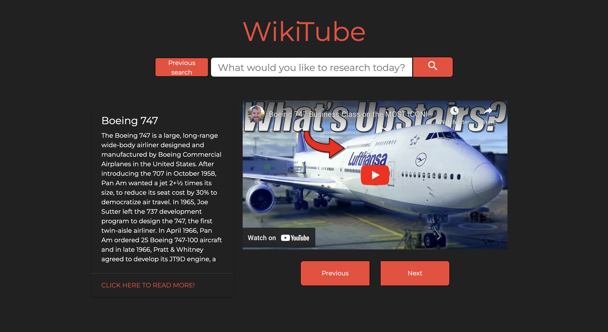
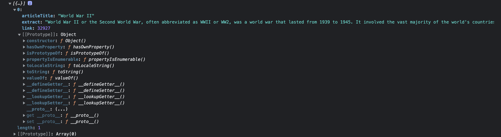
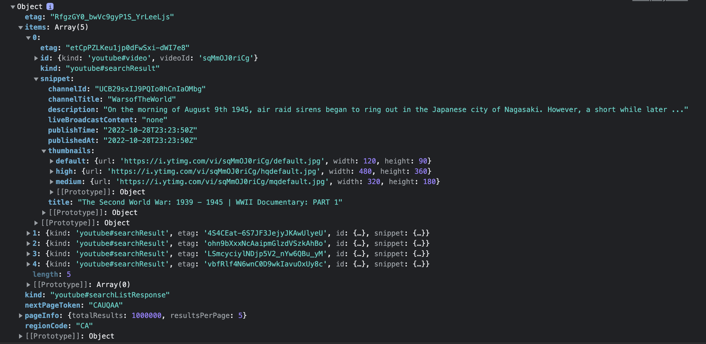

# WikiTube
A repo for project-1, WikiTube.

## Description:
  
WikiTube uses the wikipedia and youtube API's to grab articles/videos based on the users searches.
  - Motivation for this project was to expand our knowledge on using API's, and finding ways to implement their data practically into an app that serves a a purpose, rather than just pure practise. 
  - We built this application to be able to access information from two different sources on one screen/tab and based off of one search.
  - Building this project we learned how to work in a group repo using git, pushing/pulling and then merging our work together and solving any conflicts. The CSS was done using materialize which was new to all of us, as well as the API's themselves. We had to figure out how to fetch and manipulate the returned data to display only what we wanted.
  
## Installation:
This project can be viewed on github pages here: https://friduwulf.github.io/Wikitube/

## Usage:
;
;
;
;

## Credits:
This app was built by Devin, Daria and Gabe.

## License:
MIT license